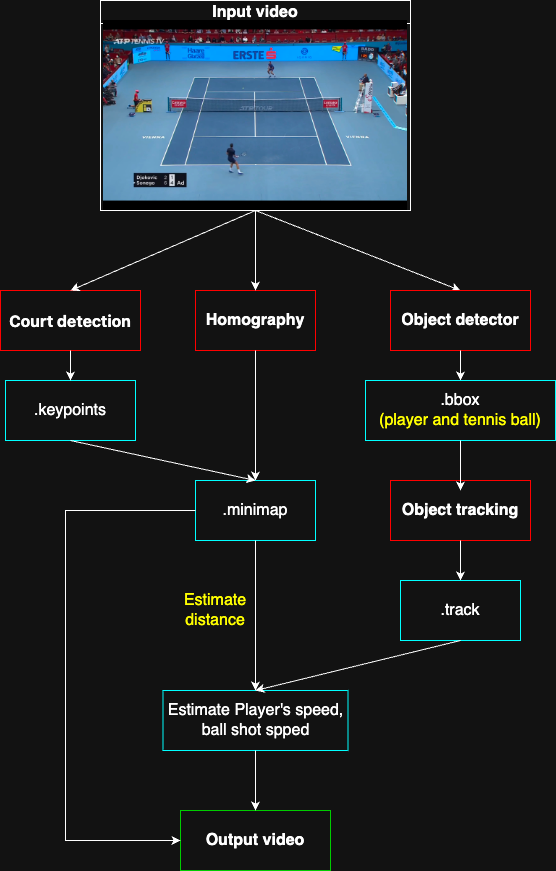

 <h1 align="center">Tennis Analysis</h1>

## Introduction
Here is my python source code. The following are the functions:
- Detect players
- Estimate their speed, ball shot speed and distance
- Create a minimap visualization.

## Output Videos

  

## How It Works

  

## How to Training

### Player detection 
- You can use `yolov8x.pt` to try model

### Tennis detetion
1. You click here [Robowflow Tennis ball Dataset](https://universe.roboflow.com/viren-dhanwani/tennis-ball-detection) to download the dataset
2. To detect small objects better, you should download the YOLOv5 dataset version.
3. Run `train.py --img 640 --batch 8 --epochs 100 --data data.yaml --weights yolo5l6.pt`

### Court detection
1. Click this link [Court dataset](https://drive.google.com/file/d/1lhAaeQCmk2y440PmagA0KmIVBIysVMwu/view?usp=drive_link) to download the dataset
2. Run `python training/tennis_court_keypoints_training.py`

## How To Use
Prepare a video file
1. Clone the repository `https://github.com/HoangViet252006/Tennis-Analysis.git`
2. Run `pip install -r requirements.txt` to install packages required
3. Run `python main.py -i <your input video path> -o <your output video path>`
